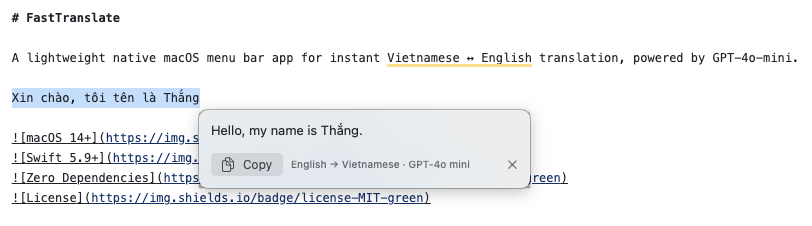

# HotLingo

A lightweight native macOS menu bar app for instant Vietnamese ↔ English translation, powered by AI.


## The Problem

If you work with English-speaking clients daily, you probably do this dozens of times:

1. Open ChatGPT → type Vietnamese → copy translation → paste into Slack/email (**30-60s**)
2. Screenshot a client message → upload to AI → wait for translation (**30-60s**)
3. End up with tons of junk screenshot files cluttering your desktop

**HotLingo reduces each translation to 2-3 seconds — right from any app, with zero context switching.**

## Demo

> Select text in any app → press `⌃⌥T` → translation appears instantly near your cursor



## Features

### Translate Selected Text (default `⌃⌥T`)
Select text in **any app** → press the hotkey → a floating panel streams the translation token-by-token near your cursor. Works in Chrome, Slack, VS Code, Zalo — anywhere.

### Screenshot OCR → Translate (default `⌃⌥S`)
Press the hotkey → drag to select a screen region → Vision OCR extracts the text → translation streams instantly. No screenshot files saved to disk.

### Customizable Hotkeys
Rebind translate and screenshot shortcuts to any key combination in Settings → Hotkeys.

### Smart Multilingual Detection
Auto-detects source language and picks the right target — type Vietnamese to get English, type English to get Vietnamese.

### Menu Bar Popover
Click the menu bar icon → type or paste text with optional context → get translation. Useful for longer passages.

### Real-time Streaming
Translations appear **token-by-token** as the AI generates them — no waiting for the full response.

### Smart Context System
Provide context for more accurate, natural translations:

| Context Layer | Description | Example |
|:-------------|:------------|:--------|
| **Persistent** | Set once in Settings, always sent | "Use professional but friendly tone" |
| **Per-message** | One-time context for a specific translation | "This is about a production database bug" |
| **Screenshot** | Full screen region text used as conversation context | Capture the full chat thread for context |

### Translation History
Last 50 translations are saved and searchable. Delete individual entries or browse from the menu bar popover.

### Credit-based AI Translation
Sign in with your account, purchase credits, and use AI-powered translation with real-time SSE streaming.

### i18n Support
Full English and Vietnamese localization for all UI strings.

## Installation

### Download
Download the latest `.dmg` from [Releases](https://github.com/sawsew467/macos-fast-translate/releases).

### Build from Source

**Prerequisites:** macOS 13+ and Xcode 15+

```bash
git clone https://github.com/sawsew467/macos-fast-translate.git
cd macos-fast-translate
open HotLingo.xcodeproj
# Press ⌘R to build and run
```

No package managers, no `pod install`, no `swift package resolve` — zero external dependencies.

### First Launch

1. **Choose translation provider** — Google Translate (free) or AI-powered (credits required)
2. **Grant Accessibility** — required for global hotkeys and reading selected text
3. **Grant Screen Recording** — required for screenshot OCR (optional if you don't use `⌃⌥S`)

## Usage

| Shortcut | Action |
|:---------|:-------|
| `⌃⌥T` (default) | Translate selected text in any app |
| `⌃⌥S` (default) | Screenshot region → OCR → translate |
| Click menu bar icon | Open translation popover |
| `⌘,` | Open Settings |

Hotkeys are customizable in Settings → Hotkeys.

## Architecture

```
HotLingo/
├── App/                  # App entry point, AppDelegate, menu bar setup
├── Models/               # Translation models, streaming state, hotkey bindings
├── Services/             # Core logic
│   ├── TranslationService       # Translation coordinator, context merging, history
│   ├── OpenAITranslationProvider # GPT-4o-mini API (SSE streaming)
│   ├── GoogleTranslateProvider  # Free Google Translate (default)
│   ├── AITranslationProvider    # Supabase credit-based AI translation (SSE)
│   ├── HotkeyManager            # Carbon API global hotkeys
│   ├── HotkeyStore              # Persistent storage for custom hotkey bindings
│   ├── SelectedTextReader       # AX API + clipboard fallback
│   ├── ScreenCaptureService     # Region selection overlay
│   ├── OCRService               # Apple Vision text recognition
│   └── LanguageDetector         # Vi/En detection via Unicode analysis
├── Views/                # SwiftUI views, floating panel, settings, hotkey recorder
├── Utils/                # Keychain helper, constants
└── Resources/            # Info.plist, entitlements, assets
```

## Tech Stack

| Component | Technology | Why |
|:----------|:-----------|:----|
| UI | SwiftUI + AppKit | Native macOS, ~10MB binary |
| Translation | Google Translate / AI (SSE) | Free default + premium AI option |
| OCR | Apple Vision | Offline, supports Vietnamese |
| Hotkeys | Carbon Events API | Works globally across all apps |
| Text reading | Accessibility API | Primary; clipboard simulation as fallback |
| Storage | Keychain + UserDefaults | Secure API key storage |
| Auth & Credits | Supabase | Authentication and credit-based billing |

## Security

- API keys stored in **macOS Keychain** (not in files or UserDefaults)
- No data sent anywhere except translation API endpoints
- `.env` files are gitignored
- App is **notarized** by Apple for distribution

## Contributing

Contributions welcome! See the docs for architecture details:

- [`docs/system-architecture.md`](docs/system-architecture.md) — architecture and data flows
- [`docs/code-standards.md`](docs/code-standards.md) — coding conventions
- [`docs/tech-stack.md`](docs/tech-stack.md) — technology choices
- [`docs/product-overview.md`](docs/product-overview.md) — product features and use cases

## License

[MIT](LICENSE)
